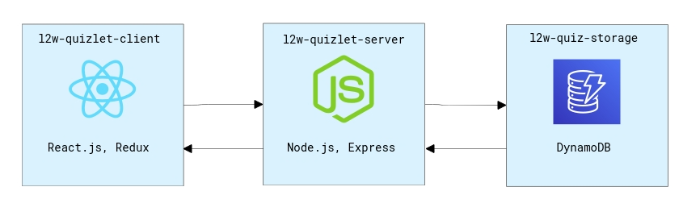

## L2W Assignment

### Architecture

### Spaced Repetition Algorithm Implementation

Conceptually there are n boxes containing k flashcards (where a flashcard is your typical question with answers).

Each question/flashcard starts in the first box. For each correct answer, the question is moved into the next box (promote).
For each wrong answer the question is moved backwards (demote). If the question is answered correctly while in the last box, it is finished.
 
This happens for each session where a session contains all of the current cards the user has not finished.
Each session is represented by a Heap where the questions with the lowest box values are at the top. (0,0,1,2,3)

As questions are encountered and answered they are added to the next session but only if they haven't
reached the last box.

Once the current session is empty, all questions from the next session are added to the current session
and the quiz continues.

Lastly, if a user decides to skip a card the card is put into the next session. The "punishment" is a reduction in score.

This algorithm is based on https://en.wikipedia.org/wiki/Leitner_system.

### Edge Case Improvements:

1. Handling of small quizzes.
For a quiz with a single question, the user has to answer the same question multiple times. Would be best to have a minimum number of questions per quiz.

2. If there is only one question left and it has not reached the last box, the user will see the question multiple times in a row before the quiz is finished. Would be best to randomize the order of answers for consecutive identical questions.

### Production Ready Improvements:

Right now there are three layers to the l2w-quizlet application. The client, server, and db. In a production environment, I'd want to maximize availability, reliability, and maintainability.

### Production Ready Improvements:

Right now, there are three layers to the l2w-quizlet application: the client, server, and DB. In a production environment, I'd want to maximize availability, reliability, and maintainability.

#### Availability and Reliability

To improve the application's availability, I'd need to ensure that the user can consistently access their quizzes without issue. At high load, the current system could prove problematic. To address this, I'd put a load balancer in front of the server layer and run multiple instances of the l2w-quizlet server to split traffic between multiple servers. To properly split the traffic between each service, there are several ways to handle this. In this application, I think the best and simplest way would be to use the Round Robin method. Seeing as the servers are not maintaining persistent connections with the client, using the Round Robin method would work well to split up requests evenly. If I needed to scale on top of this, I could quickly scale horizontally by adding more l2w-quizlet-servers under the load balancer.
With that done, the bottleneck would likely be between the l2w-quizlet-servers and database. To handle this, I could do a few things.

One thing that will help speed things up is to start caching results. I can either have a cache on each application server or a global cache. Seeing as I have multiple application servers, though, having a separate cache on each server would not be ideal. It would be inconsistent as we couldn't update other server's cache's from a different server without adding unnecessary complexity to our system. It would be inefficient as cached data for one user may not be available from certain servers. There would likely be lots of duplicate data being cached too. So the solution, in this case, would be to instead use a global cache that would run on its own server and cache the results from DB queries to minimize the number of queries being executed. The tradeoff would be an increase in latency (compared to the in-memory cache), but overall this is the best choice. To manage cache invalidation, since this application is read-heavy, I would implement a write-through cache where all operations that alter data in our DB would also write to the cache so as to prevent inaccurate data. To manage the amount of memory needed for this cache server, I'd need to have an eviction policy. In the case of this application, I think deleting the least recently used items in the cache would be best as users who haven't used the application in a while don't need their information cached. If, for whatever reason, this is still the bottleneck in our application, I can split up the global cache into multiple caches that are partitioned in such a way that a load balancer can determine which cache has certain information. If I were to go this route, the goal would be to have each cache server be approximately the same size, so I'd want to split it up in a way that allows that to happen. Additionally, if I wanted to add more cache servers or remove some, I'd want it to be able to adjust properly. To do this, I would use consistent hashing. The way this could work for this application is the load balancer in front of these cache servers would hash the URL of each request such that the output would be an integer from 0-256. Then the load balancer would route the request to the cache server "closest" to that integer. If I wanted to remove or add a cache server, I would then just need to move k/n keys where k is the number of keys and n is the number of cache servers.

Now the bottleneck is between our l2w-quizlet-servers and Dynamodb.

In general, DynamoDB scales horizontally on its own thanks to AWS's awesomeness. Also, because our data isn't relational, the latency is very low already when it comes to accessing quiz data. Additionally, the data is partitioned by user, so the query speeds are fast as is. DynamoDB tends to be pretty cheap, as well. In using DynamoDB, the result is that things are easier to maintain as most of the overhead is handled by AWS. But let's say I wanted to utilize my own database to reduce costs and handle everything on my own.

So if I go that route, let's scrap DynamoDB and go for MongoDB. My quiz document will remain the same and be indexed by the user's email. In order to match DynamoDB in terms of its scalability, I'd want to deploy a MongoDB cluster that is sharded by a key with high cardinality (many distinct values), low frequency (uniform distribution). This can be handled in the same I would split up our cache servers by using consistent hashing. We generate a key that again maps to a number from 0-256 and then use MongoDB's Hashed Sharding to have it automatically route the query. This helps for availability, but to improve reliability, I'd also want replicas of our database so as to prevent downtime. Luckily, MongoDB already handles this, so we should be good. Lastly, this would need to be deployed, and we can use MongoDB Atlas to handle this deployment.
So now, in theory our data is highly available by virtue of our multiple l2w-quizlet-servers, cache servers, and properly sharded database. It is also reliable due to our database replication.

#### Maintainability

The above is great but obviously creates a lot of overhead. To make everything a bit easier to deploy, there are a number of resources that I could use. One option would be to pull everything out into a CloudFormation, which will allow us to provision each component of our application quickly and consistently. We could also use the AWS CDK instead of CloudFormation. The idea in using either would be to centralize the configuration of this application and make it easy to make changes to the overall structure.
But what about the components themselves.

#### Client Improvements:

One thing that could be subject to change is the algorithm used for the actual quizzing. I tried to abstract out the functionality for this as best I could, but without using typescript, I wasn't able to create an interface that would allow for multiple implementations of the quizzing algorithm. If I were to restart this project, I would do it in typescript so as to allow me to set that up properly. With this addition, the type of algorithm could be selected by the user, and if I were to pull out some of the configuration, the algorithms themselves could also be tweaked by the user and for that user.

Right now, I'm using Auth0 for all authentication-related functionality which reduces overhead significantly, but in the case that the costs in using Auth0 became too great, I'd create an authentication microservice that, similarly to the l2w-quizlet-server, would also be behind a load balancer and have multiple instances of itself running. This microservice would then have to implement OAuth functionality and would communicate with both the l2w-quizlet-servers and the client. There would also be a bit more to handle on the database side of things. Additionally, my l2w-quizlet-servers aren't fully restricting requests to the extent that they need to. Right now, a user with a valid JWT token could theoretically access other user's data. One thing that I would need to do for a prod ready app is limit the scope so that this doesn't happen.
Also, all static content should be put into a content distribution network. I have not done this but would do it for prod.

Additionally, to improve overall website loading speed, one thing that would help is to minify JS, CSS, and HTML. Luckily in using create-react-app, this happens automatically in the build stage.

